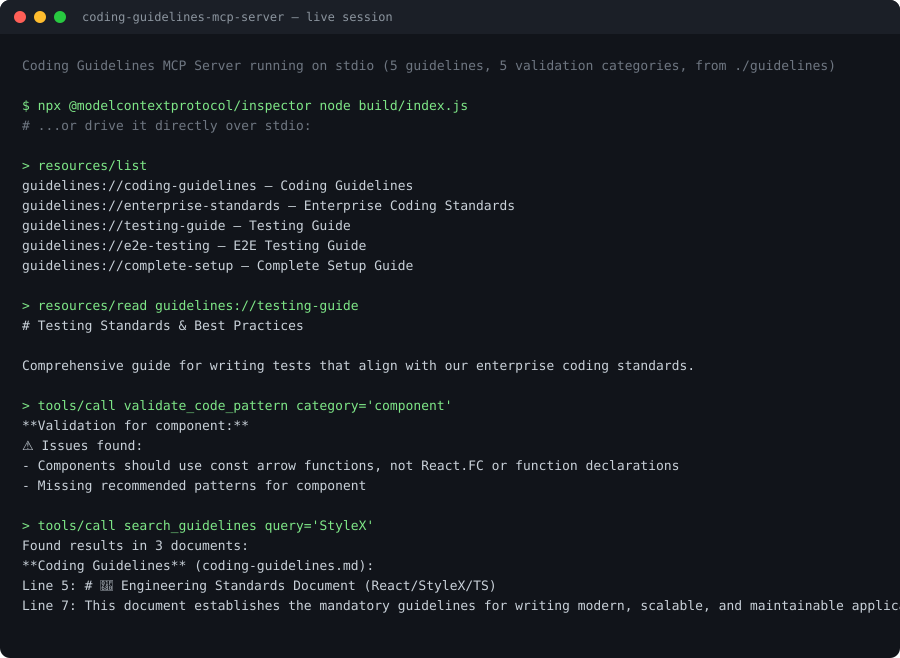

# Coding Guidelines MCP Server

An [MCP](https://modelcontextprotocol.io) server that serves a set of coding guidelines to AI assistants — as **resources** they can read, and **tools** they can call to search and validate code against those guidelines.

The repository ships two things built from the same source:

|                        | What it is                                                                    | Entry point        |
| ---------------------- | ----------------------------------------------------------------------------- | ------------------ |
| **MCP server**         | A stdio MCP server, usable from any MCP client                                | `build/index.js`   |
| **VS Code chat agent** | A chat participant (`@guidelines`) that runs the server above as a subprocess | `out/extension.js` |

## See it running

Captured from a real session against the built server — regenerate with
`npm run demo`, which drives the server and rewrites this image from whatever it
actually replies.



## Architecture

```
MCP client                       this server                    your content
(Copilot, Claude Desktop, CLI)
        │
        │  resources/list ──────▶ manifest ─────────────────────▶ guidelines.config.json
        │  resources/read ──────▶ read file by uri ─────────────▶ frontend-standards.md
        │                                                          api-conventions.md
        │  tools/list     ──────▶ buildTools(guidelines)              ...
        │  tools/call     ──┬───▶ search_guidelines ─────────────▶ (grep across all docs)
        │                   ├───▶ get_guideline_summary ─────────▶ (one doc, or one section)
        │                   ├───▶ validate_code_pattern ────────▶ validation-rules.ts
        │                   └───▶ generate_code ────────────────▶ scaffold templates
        ▼
   stdio, JSON-RPC
```

Three things to notice:

1. **Documents are resources; actions are tools.** Reading a standards document
   is an addressable, side-effect-free retrieval the _user_ chooses. Validating a
   snippet is a computation the _model_ invokes with an argument. Those are
   different MCP surfaces, on purpose —
   [ADR 0001](docs/adr/0001-mcp-resources-vs-tools.md).
2. **The guideline set is data.** `guidelines.config.json` in the guidelines
   directory decides which documents exist and what URIs they answer to. `src/`
   never names a document —
   [ADR 0002](docs/adr/0002-guidelines-as-configuration.md).
3. **Only `validate_code_pattern` holds opinions in code**, as regex
   pattern/anti-pattern pairs in `src/config/validation-rules.ts`.

## Use this as a template

Point it at your own standards in about five minutes — replace the Markdown in
`guidelines/`, describe it in `guidelines.config.json`, rebuild. No TypeScript.

**→ [TEMPLATE.md](TEMPLATE.md)**

That claim is tested rather than asserted: the integration suite boots the real
server against a second guideline set (`tests/fixtures/alt-guidelines/`, with
different URIs, filenames and document count) and checks it serves that set.

## Features

**Resources** — each guideline document, addressable by URI:

| URI                                 | Document                       |
| ----------------------------------- | ------------------------------ |
| `guidelines://coding-guidelines`    | Main coding guidelines         |
| `guidelines://enterprise-standards` | Enterprise coding standards    |
| `guidelines://testing-guide`        | Testing standards              |
| `guidelines://e2e-testing`          | E2E testing guide (Playwright) |
| `guidelines://complete-setup`       | Complete project setup guide   |

**Tools:**

| Tool                    | Purpose                                                        |
| ----------------------- | -------------------------------------------------------------- |
| `search_guidelines`     | Substring search across every guideline document               |
| `validate_code_pattern` | Check a snippet against the patterns for one category          |
| `get_guideline_summary` | Retrieve a whole document's opening, or one named section      |
| `generate_code`         | Scaffold a component, hook, feature, or project bootstrap plan |

## Installation

```bash
npm install
npm run build
```

`npm run build` produces both artifacts: the bundled MCP server at `build/index.js` and the compiled VS Code extension at `out/`.

## Usage

### Option 1: Direct testing (command line)

The MCP protocol requires an `initialize` handshake before the server will answer any other method, so a single piped request returns nothing. Send the handshake in the same stream:

```bash
printf '%s\n%s\n%s\n' \
  '{"jsonrpc":"2.0","id":0,"method":"initialize","params":{"protocolVersion":"2024-11-05","capabilities":{},"clientInfo":{"name":"cli","version":"1.0.0"}}}' \
  '{"jsonrpc":"2.0","method":"notifications/initialized"}' \
  '{"jsonrpc":"2.0","id":1,"method":"resources/list"}' \
  | node build/index.js
```

Swap the last line for any other request:

```bash
# Read a guideline
'{"jsonrpc":"2.0","id":1,"method":"resources/read","params":{"uri":"guidelines://coding-guidelines"}}'

# Search guidelines
'{"jsonrpc":"2.0","id":1,"method":"tools/call","params":{"name":"search_guidelines","arguments":{"query":"StyleX"}}}'

# Validate a snippet
'{"jsonrpc":"2.0","id":1,"method":"tools/call","params":{"name":"validate_code_pattern","arguments":{"code":"const Button = () => null;","category":"component"}}}'
```

### Option 2: MCP Inspector (visual testing)

```bash
npx @modelcontextprotocol/inspector node build/index.js
```

### Option 3: Use it from an MCP client

**GitHub Copilot (VS Code)** — create `.vscode/mcp.json` in your workspace:

```json
{
  "servers": {
    "coding-guidelines": {
      "command": "node",
      "args": ["/absolute/path/to/build/index.js"]
    }
  }
}
```

**Claude Desktop** — add the same command/args under `mcpServers` in your `claude_desktop_config.json`. See the [MCP quickstart](https://modelcontextprotocol.io/quickstart/user) for the file's location on your platform.

**Any other MCP client** — run `node /absolute/path/to/build/index.js` over stdio.

By default the server reads guidelines from the `guidelines/` directory next to the build output. Set `GUIDELINES_PATH` to point it somewhere else.

### Option 4: The VS Code chat agent

Requires **VS Code 1.134 or newer** (`engines.vscode`). The extension is a chat
participant, and the Copilot MCP integration above needs 1.102+, so a recent
VS Code was already implied.

Build the package, then install it:

```bash
npm run build:vsix
code --install-extension coding-guidelines-agent-1.0.0.vsix
```

The `.vsix` is not committed to the repository — it is built from source, and CI
attaches one to every tagged release. Then use `@guidelines` in VS Code Chat:

```
@guidelines /search StyleX
@guidelines /validate const Button = () => null;
@guidelines /summary Testing Guide
```

## Compatibility

Claims about other tools go stale. Each row records what was checked and when, so it can be rechecked.

| Client                                     | MCP support                             | How this was checked                                                                                                           | Date       |
| ------------------------------------------ | --------------------------------------- | ------------------------------------------------------------------------------------------------------------------------------ | ---------- |
| CLI over stdio                             | Works                                   | Ran the handshake transcript above against this server; `resources/list` returned all 5 resources and `tools/list` all 4 tools | 2026-09-02 |
| GitHub Copilot — VS Code                   | Generally available since VS Code 1.102 | Vendor documentation only — **not yet verified against this server**                                                           | 2026-09-02 |
| GitHub Copilot — Visual Studio             | Generally available (17.14+)            | Vendor documentation only                                                                                                      | 2026-09-02 |
| GitHub Copilot — JetBrains, Xcode, Eclipse | Public preview                          | Vendor documentation only                                                                                                      | 2026-09-02 |
| Claude Desktop                             | Supported                               | Vendor documentation only — config format not re-verified                                                                      | 2026-09-02 |

Note for organisation users: MCP in Copilot is governed by the _MCP servers in Copilot_ policy, which is **disabled by default** and must be enabled by an org or enterprise administrator.

Sources: [MCP support in VS Code is generally available](https://github.blog/changelog/2025-07-14-model-context-protocol-mcp-support-in-vs-code-is-generally-available/) · [Extending Copilot Chat with MCP](https://docs.github.com/copilot/customizing-copilot/using-model-context-protocol/extending-copilot-chat-with-mcp)

> An earlier version of this README stated that "GitHub Copilot does not currently support MCP servers." That has been untrue since July 2025.

## Development

```bash
npm run build       # build both the MCP server and the extension
npm run watch       # watch mode for the extension
npm test            # vitest: unit + a live stdio integration suite
npm run lint        # eslint
npm run typecheck   # tsc --noEmit over both projects
npm run format      # prettier
npm run demo        # re-record docs/demo.svg from a live run
npm run package     # build the .vsix
```

Every one of these runs in CI on each pull request, across Node 20 and 22.

## Project layout

| Path                                | What lives there                                               |
| ----------------------------------- | -------------------------------------------------------------- |
| `src/index.ts`                      | Server entry point: loads the manifest, registers handlers     |
| `src/config/guidelines-manifest.ts` | Manifest loading and validation                                |
| `src/config/validation-rules.ts`    | The regex rules behind `validate_code_pattern`                 |
| `src/resources/`                    | Resource handlers (`resources/list`, `resources/read`)         |
| `src/tools/`                        | One module per tool, plus dispatch                             |
| `src/extension/`                    | The VS Code chat participant                                   |
| `guidelines/`                       | The documents served, and the manifest describing them         |
| `tests/`                            | Unit suites, a stdio integration suite, and guideline fixtures |
| `docs/adr/`                         | Architecture decision records                                  |

## License

MIT
